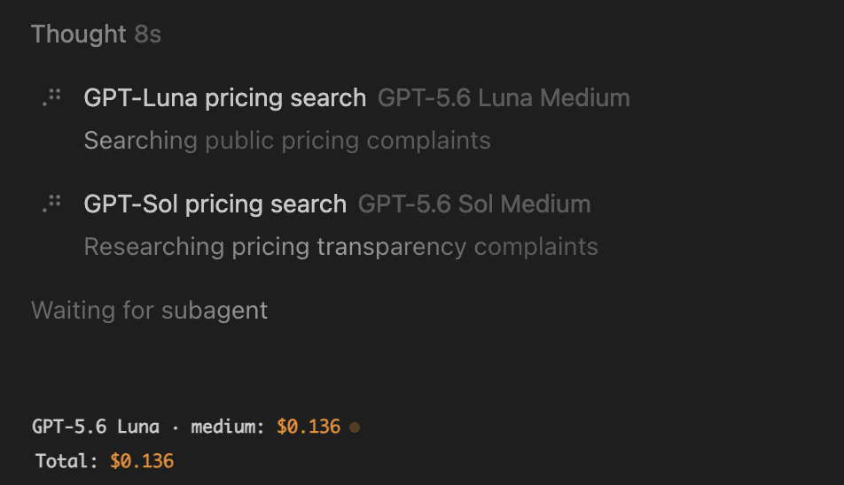
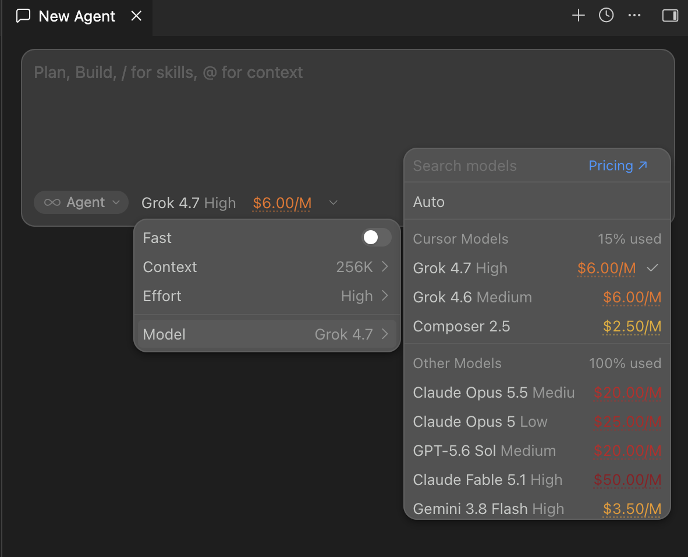
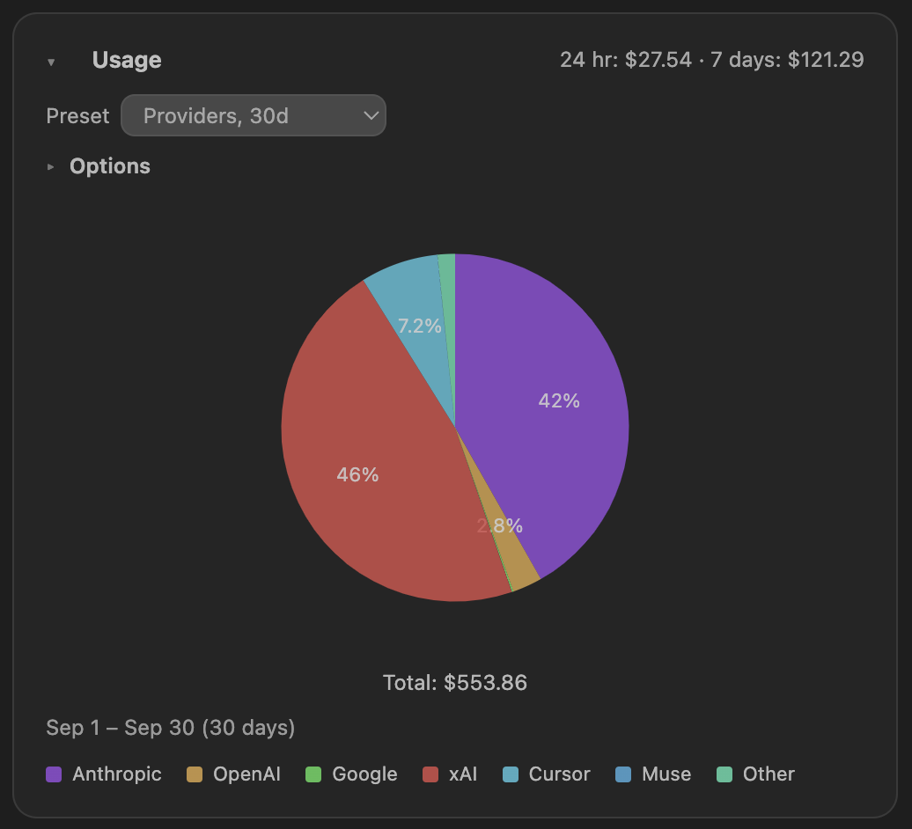
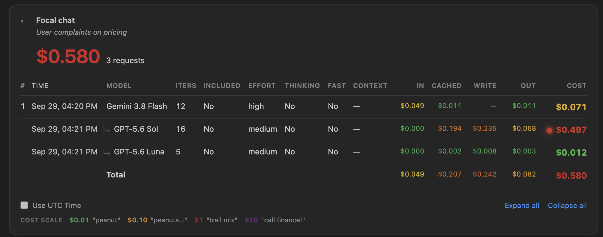
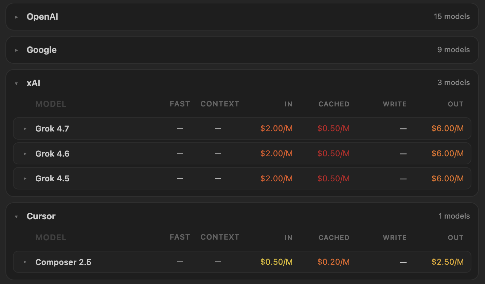

# Spendgeist

**See what's haunting your AI spending.**

[Install on Cursor (Open VSX)](https://open-vsx.org/extension/rkishony/ai-cost) · [Pricing table](https://agentcostmonitor.com/pricing) · [Issues](https://github.com/rkishony/Spendgeist/issues)

## What you get

- **Real-time usage cost** while you code — live spend from your Cursor account, always visible
- **Model costs in context** — per-turn spend in chat and rates in the picker before you choose
- **Graphical spend analytics** — trends, billing periods, and breakdowns by model, project, and provider
- **Ask about your usage** — ask the agent how much you spent, which models you used, or what a model costs. It answers from your local usage and opens the matching graph

**Usage stays on your machine.** Token counts and request metadata are only cached locally. Pricing fetches only sends a random install id (see Privacy).

## Screenshots

| | |
|---|---|
| Per-turn cost in chat | Model picker rates |
|  |  |
| Usage graph | Focal chat (sidebar) |
|  |  |
| Pricing table | |
|  | |

## Pricing data

This repository holds the Cursor's pricing table the extension downloads:

| File | Purpose |
|------|---------|
| [`extension/pricing.json`](extension/pricing.json) | Machine-readable rates, also published at `/extension/pricing.json` (default `cursorCost.pricingUrl`) |
| [`pricing.csv`](pricing.csv) | Human-reviewed source |
| [`docs/pricing.html`](https://agentcostmonitor.com/pricing) | Browseable rate table |

Not official rates. Rates are scrapped from [Cursor’s public model docs](https://cursor.com/docs/models-and-pricing).

## Ask about usage

Ask in chat, for example “how much did I spend this week?” or “which model is good value?”. Spendgeist gives the agent your local totals and rates, then opens the usage graph or the pricing table.

This is installed with the extension. It answers only while Spendgeist is running in that Cursor window.

## Install

1. Open Cursor → Extensions
2. Search **Spendgeist** or install from [Open VSX](https://open-vsx.org/extension/rkishony/ai-cost)
3. Click the **$** in the status bar to open details

## Privacy

- Pulls usage from Cursor, and the pricing table from [agentcostmonitor.com/extension/pricing.json](https://agentcostmonitor.com/extension/pricing.json).
- Each pricing fetch includes a random install id created on your machine. It is not tied to an account. The site uses this random-id to count number of active users.
- Request metadata and token counts stay in local extension storage.
- When you ask the agent about usage, that question’s totals and rates go to the model you are already chatting with. Prompts and the usage records stay on your machine.
- Cursor usage API uses your existing Cursor sign-in to read dashboard data — cached locally only.

## License

MIT — [LICENSE](LICENSE).
